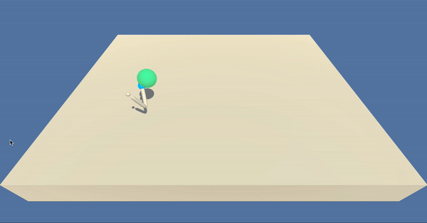

# Unity Reacher environment

### Introduction

We provide an implementation of DDPG to solve the single-arm Unity [Reacher](https://github.com/Unity-Technologies/ml-agents/blob/master/docs/Learning-Environment-Examples.md#reacher) environment.



The set-up is as follows: the agent controls a double-jointed arm with a blue sphere on it. The agent recieves a reward of +0.1 for every timestep that that the sphere is in contact with the moving orb. At each timestep, the agent observes 33 dimensional vector encodes information about the environment (e.g. position, velocity, and rotation of the arm) and interacts with the environment outputting four dimensonal vector.

While this repository provides a solution for the single-arm Reacher environment, there is a sister environment with multiple arms:


### Solving the Environment
To solve the single-arm environment, the agent must get an average score of +30 over 100 consecutive episodes. To solve the multi-arm environment, the agent must, averaging over all arms, obtain a score of +30 over 100 consecutive episodes.

### Solution

We use the [deep deterministic policy gradients](https://arxiv.org/abs/1509.02971) (DDPG) deep reinforcement learning algorithm to solve the single-arm environment. We proceeded as follows:

1. The standard episode for the Reacher environment runs for 1000 timesteps. We trained the agent on 800 timestep episodes. The agent trained on 800-timestep episodes achieved a maximum average score of ~28.6 over 100 episodes. 

2. We took the weights from the agent trained on 800-timestep episodes and ran it on standard 1000-timestep episodes, immediately solving the environment with an average score of 33.7.

### Try it yourself!

0. Install anaconda from [here](https://www.anaconda.com/distribution/).

1. Install unity ml-agents using the [instructions](https://github.com/Unity-Technologies/ml-agents/blob/master/docs/Installation.md) here.

2. Download the Reacher environment from one of the links below.  You need only select the environment that matches your operating system:

|Version|Binary|
|-------|-----|
|**Version 1: 1 reacher**|[LINUX](https://s3-us-west-1.amazonaws.com/udacity-drlnd/P2/Reacher/one_agent/Reacher_Linux.zip), [LINUX-NO-VIZ](https://s3-us-west-1.amazonaws.com/udacity-drlnd/P2/Reacher/one_agent/Reacher_Linux_NoVis.zip), [MAC](https://s3-us-west-1.amazonaws.com/udacity-drlnd/P2/Reacher/one_agent/Reacher.app.zip), [WIN32](https://s3-us-west-1.amazonaws.com/udacity-drlnd/P2/Reacher/one_agent/Reacher_Windows_x86.zip)|[WIN64](https://s3-us-west-1.amazonaws.com/udacity-drlnd/P2/Reacher/one_agent/Reacher_Windows_x86_64.zip)|
|**Version 2: multiple reachers**|[LINUX](https://s3-us-west-1.amazonaws.com/udacity-drlnd/P2/Reacher/Reacher_Linux.zip),[LINUX-NO-VIZ](https://s3-us-west-1.amazonaws.com/udacity-drlnd/P2/Reacher/Reacher_Linux_NoVis.zip),  [MAC](https://s3-us-west-1.amazonaws.com/udacity-drlnd/P2/Reacher/Reacher.app.zip), [WIN32](https://s3-us-west-1.amazonaws.com/udacity-drlnd/P2/Reacher/Reacher_Windows_x86.zip), [WIN64](https://s3-us-west-1.amazonaws.com/udacity-drlnd/P2/Reacher/Reacher_Windows_x86_64.zip)|

3. Download the Reacher_DDPG.ipynb notebook from this repository to try training the agent. Follow these simple [these instructions](https://stackoverflow.com/questions/45622602/how-to-save-jupyter-notebooks-from-github).

4. Go to the relevant terminal and create a conda environment
```
conda create -n myenv python=3.6
```

5. Activate the environment and open jupyter notebooks
```
conda activate myenv
jupyter notebook
```

Then open up the Reacher_DDPG notebook and run it.

6. To watch the trained agent, download actor_checkpoint.pth and critic_checkpoint.pth from this repository and run the Trained.ipynb notebook instead.

Remember the implementation in this repository is made for the single-arm environment. If you're not on a Mac make sure to change the filename of the environment in the notebook.
