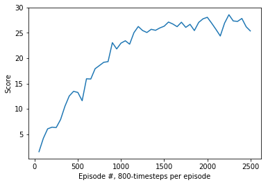

# Algorithm overview
The algorithm used is Deep Deterministic Policy Gradient, an Actor-Critic class Deep Reinforcement Learning algorithm. The original paper can be found [here](). OpenAI's [article](https://spinningup.openai.com/en/latest/algorithms/ddpg.html) on the algorithm and [this](https://towardsdatascience.com/deep-deterministic-policy-gradients-explained-2d94655a9b7b) article are good places to start to understand DDPG.

In brief, the main features of the algorithm are:

1. It is a Q-learning method, i.e. the algorithms tries to estimate the value Q(s,a) of (state,action) pairs given a policy.
2. It is an Actor-Critic algorithm where the Critic is a NN that updates the estimate of Q given the current policy, the Actor is a NN that updates the policy given the updated estimates of Q.
3. The main feature of DDPG is that it can be used to solve environments with continuous action spaces, and uses policy gradient to update the Actor.
4. The Actor outputs actions given the current state. Exploration of the action space is implemented by adding noise to the output of the actor; the particular implementation of the noise is the [Ornstein-Uhlenbeck Process](https://en.wikipedia.org/wiki/Ornstein%E2%80%93Uhlenbeck_process).

## Parameters
### Hyperparameters
| Parameter | Value|
| --- | --- |
| Replay buffer size | 1e6 |
| BATCH_SIZE | 1000 |        
| GAMMA | 0.99 |           
| TAU | 1e-3 |             
| LR_ACTOR | 1e-3 |        
| LR_CRITIC | 1e-3 |       

### Actor network architecture:
| Layer | Size |
| --- | --- |
| input | 33 |
| hidden_1 | 380 |
| ReLU | - |
| hidden_2 | 280 |
| ReLU | - |
| output | 4 |

### Critic network architecture:
| Layer | Size |
| --- | --- |
| input | 33 |
| hidden_1 | 380 |
| ReLU | - |
| concat with actor output | - |
| hidden_2 | 280 |
| ReLU | - |
| output | 1 |

## Solution
We first trained the agent on 800-timestep episodes, obtaining the following training graph:

   

Then we used the saved weights from the training run on 1000-timestep episodes, immediately solving the environment, as seen in the performance here:

  

An average of 30.0 per 1000-timestep episode is equivalent (all other things being equal) to a score of (30.0/1000) * 800 = 0.8 * 30 = 24.0 per 800-timestep episode.
Looking at the training graph, The first average score per 100 episodes to exceed 24.0 is at 1150. Therefore the environment was solved (at latest) at episode (1150-100) = 1050.

## Improvements ideas

Introducing batch normalization into the Actor and Critic NNs.
